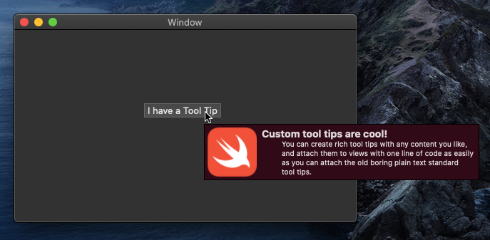

# CustomToolTip

CustomToolTip is a Swift Package for macOS Cocoa applications that lets you add tool tips that can use any kind of  `NSView` for their content without having to subclass or wrap your existing views.  That means it can be easily incorporated into an existing project.



## Project Set Up

- Step 1: Add [https://github.com/chipjarred/CustomToolTip.git](https://github.com/chipjarred/CustomToolTip.git) as a Swift Package dependency to your project in Xcode.
- Step 2: *There is no step 2!*

CustomToolTip provides an extension on `NSView` that handles the rest.  You can focus on creating your tool tip content and attach it to your views with the `customToolTip` property that the extension adds to `NSView`.

You don't need to subclass anything. You don't need to nest views in a special tool tip view.  You don't even need to change anything in storyboards.  

## How to add custom tool tips

In the source files where you want to add custom tool tips, 

```swift
import CustomToolTip
```
Then adding a tool tip is as easy as

```swift
myControl.customToolTip = myCustomTipContentView
```
where `myControl`, is the view to which you want to attach a custom tool tip, and  `myCustomTipContentView` is any `NSView` you want to use as the tool tip's content.

The only technical requirement for your tool tip view is that its frame size should be properly set before adding it, as the tool tip will adjust its size according to your content view's frame.  

There are design considerations for your tool tip content, but those will largely depend on taste, the look and feel of your app, and current thought on good design.  The only suggestions I'll make are to keep your tool tips relatively small, and avoid using any view in them that looks like the user should interact with it, because... it's a tool tip.  It will disappear when the user moves the mouse.  

You can specify the margins between your custom tool tip content view, and the tool tip's window frame:

```swift
myControl.customToolTipMargins = CGSize(width: 5, height: 5)
```

By default CustomToolTip uses the current system window background color for the tool tip's background, but you can use any color you like:

```swift
myControl.customToolTipBackgroundColor = NSColor.blue
```

## Conveniences

For some especially common cases CustomToolTip provides convenience methods that will make the view for you.

If you just want to add text tool tip using a specific font, you can do it like this:

```swift
myControl.addCustomToolTip(from: "This is my tool tip", with: NSFont(name: "Chalkboard", size: 20))
```

If you have an `NSAttributedString` you'd like to display in the tool tip, you can use that:

```swift
myControl.addCustomToolTip(from: myAttributedString)
```

To use an `NSImage` as the content:

```swift
myControl.addCustomToolTip(from: myToolTipImage, scaling: .toFit(width: 50, height: 50))
```
